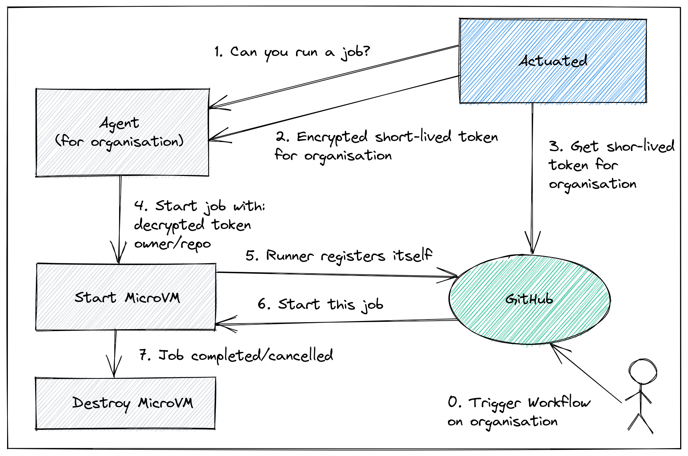

# Frequently Asked Questions (FAQ)

## How does it work?

Actuated has three main parts:

1. an agent which knows how to run VMs, you install this on your hosts
2. a VM image and Kernel that we build which has everything required for Docker, KinD and K3s
3. a multi-tenant control plane that we host, which tells your agents to start VMs and register a runner on your GitHub organisation

The multi-tenant control plane is run and operated by OpenFaaS Ltd as a SaaS.



> The conceptual overview showing how a MicroVM is requested by the control plane.

MicroVMs are only started when needed, and are registered with GitHub by the official GitHub Actions runner, using a short-lived registration token. The token is been encrypted with the public key of the agent. This ensures no other agent could use the token to bootstrap a token to the wrong organisation.

Learn more: [Self-hosted GitHub Actions API](https://docs.github.com/en/rest/actions/self-hosted-runners#create-a-registration-token-for-an-organization)

## Glossary

* `MicroVM` - a lightweight, single-use VM that is created by the Actuated Agent, and is destroyed after the build is complete. Common examples include [firecracker by AWS](https://firecracker-microvm.github.io/) and [Cloud Hypervisor](https://github.com/cloud-hypervisor/cloud-hypervisor)
* `Guest Kernel` - a Linux kernel that is used together with a Root filesystem to boot a MicroVM and run your CI workloads
* `Root filesystem` - an immutable image maintained by the actuated team containing all necessary software to perform a build
* `Actuated` ('Control Plane') - a multi-tenant SaaS run by the actuated team responsible for scheduling MicroVMs to the Actuated Agent 
* `Actuated Agent` - the software component installed on your Server which runs a MicroVM when instructed by Actuated
* `Actuated Server` ('Server') - a server on which the Actuated Agent has been installed, where your builds will execute.

## How does actuated compare to a self-hosted runner?

A self-hosted runner is a machine on which you've installed and registered the a GitHub runner.

Quite often these machines suffer from some, if not all of the following issues:

* They require several hours to get all the required packages correctly installed to mirror a hosted runner
* You never update them out of fear of wasting time or breaking something which is working, meaning your supply chain is at risk
* Builds clash, if you're building a container image, or running a KinD cluster, names will clash, dirty state will be left over

We've heard in user interviews that the final point of dirty state can cause engineers to waste several days of effort chasing down problems.

Actuated uses a one-shot VM that is destroyed immediately after a build is completed.

## Who is actuated for?

actuated is primarily for software engineering teams who are currently using GitHub Actions. A GitHub organisation is required for installation, and runners are attached to individual repositories as required, to execute builds.

## What kind of machines do I need for the agent?

You'll need either: a bare-metal host (your own, AWS i3.metal or Equinix Metal), or a VM that supports nested virtualisation such as those provided by GCP, DigitalOcean and Azure.

## When will Jenkins, GitLab CI, BitBucket Pipeline Runners, Drone or Azure DevOps be supported?

For the pilot phase, we're targeting GitHub Actions because it has fine-grained access controls and the ability to schedule exactly one build to a runner. Most other CI systems expect self-hosted runners to perform many builds, and we believe that to be an anti-pattern. We'll offer advice to teams accepted into the pilot who wish to evaluate GitHub Actions or migrate away from another solution.

That said, if you're using these tools within your organisation, and face similar issues or concerns, we'd like to hear from you. And we have a proof of concept that works with GitLab CI, so feel free to reach out to us if you feel actuated would be a good fit for your team.

[Watch the actuated for GitLab preview](https://twitter.com/alexellisuk/status/1667130226327863298?s=20)

Feel free to contact us at: [contact@openfaas.com](mailto:contact@openfaas.com)

## Is GitHub Enterprise supported?

GitHub.com's Pro, Team and Enterprise Cloud plans are supported.

[GitHub Enterprise Server (GHES)](https://docs.github.com/en/enterprise-server@3.5/admin/overview/about-github-enterprise-server) is a self-hosted version of GitHub and may require additional configuration. Please reach out to us if you're interested in using actuated with your installation of GHES.

## What kind of access is required to my GitHub Organisation?

GitHub Apps provide fine-grained privileges, access control, and event data.

Actuated integrates with GitHub using a [GitHub App](https://docs.github.com/en/developers/apps/getting-started-with-apps/about-apps).

The actuated GitHub App will request:

* Administrative access to add/remove GitHub Actions Runners to individual repositories
* Events via webhook for Workflow Runs and Workflow Jobs

Did you know? The actuated service does not need any access to your code or private or public repositories.

## Can GitHub's self-hosted runner be used on public repos?

The GitHub team recommends only running their self-hosted runners on private repositories.

Why?

I took some time to ask one of the engineers on the GitHub Actions team.

> With the standard self-hosted runner, a bad actor could compromise the system or install malware leaving side-effects for future builds.

He replied that it's difficult for maintainers to secure their repos and workflows, and that bad actors could compromise a runner host due to the way they run multiple jobs, and are not a fresh environment for each build. It may even be because a bad actor could scan the local network of the runner and attempt to gain access to other systems.

If you're wondering whether containers and Pods are a suitable isolation level, we would recommend against this since it usually involves one of either: mounting a docker socket (which can lead to escalation to root on the host) or running Docker In Docker (DIND) which requires a privileged container (which can lead to escalation to root on the host).

So, can you use actuated on a public repo?

Our contact at GitHub stated that through VM-level isolation and an immutable VM image, the primary concerns is resolved, because there is no way to have state left over or side effects from previous builds.

Actuated fixes the isolation problem, and prevents side-effects between builds. We also have specific iptables rules in the [troubleshooting guide](/troubleshooting) which will isolate your runners from the rest of the network.

## Can I use the containers feature of GitHub Actions?

GitHub Action's [Running jobs in a container](https://docs.github.com/en/actions/using-jobs/running-jobs-in-a-container) feature is supported, as is Docker, Buildx, Kubernetes, KinD, K3s, etc.

Example of running commands with the `docker.io/node:16` image.

```yaml

jobs:
  specs:
    name: test
    runs-on: actuated
    container:
      image: docker.io/node:16
      env:
        NODE_ENV: development
      ports:
        - 3000
      options: --cpus 1
    steps:
      - name: Check for dockerenv file
        run: node --version
```

## How many builds does a single actuated VM run?

When a VM starts up, it runs the GitHub Actions Runner ephemeral (aka one-shot) mode, so in can run at most one build. After that, the VM will be destroyed.

See also: [GitHub: ephemeral runners](https://docs.github.com/en/actions/hosting-your-own-runners/autoscaling-with-self-hosted-runners#using-ephemeral-runners-for-autoscaling)

## How are VMs scheduled?

VMs are placed efficiently across your Actuated Servers using a scheduling algorithm based upon the amount of RAM reserved for the VM.

Autoscaling of VMs is automatic. Let's say that you had 10 jobs pending, but given the RAM configuration, only enough capacity to run 8 of them? The second two would be queued until capacity one or more of those 8 jobs completed.

If you find yourself regularly getting into a queued state, there are three potential changes to consider:

1. Using Actuated Servers with more RAM
2. Allocated less RAM to each job
3. Adding more Actuated Servers

The plan you select will determine how many Actuated Servers you can run, so consider 1. and 2. before 3.

## Do I need to auto-scale the Actuated Servers?

Please read the section "How are VMs scheduled".

Auto-scaling Pods or VMs is a quick, painless operation that makes sense for customer traffic, which is generally unpredictable and can be very bursty.

GitHub Actions tends to be driven by your internal development team, with a predictable pattern of activity. It's unlikely to vary massively day by day, which means autoscaling is less important than with a user-facing website.

In addition to that, bare-metal servers can take 5-10 minutes to provision and may even include a setup fee or monthly commitment, meaning that what you're used to seeing with Kubernetes or AWS Autoscaling Groups may not translate well, or even be required for CI.

If you are cost sensitive, you should review the options under [Provision a Server section](/provision-server).

Depending on your provider, you may also be able to hibernate or suspend servers on a cron schedule to save a few dollars. Actuated will hold jobs in a queue until a server is ready to take them again.

## What do I need to change in my workflows to use actuated?

Very little, just add / set `runs-on: actuated`

## Is ARM64 supported?

Yes, actuated is built to run on both Intel/AMD and ARM64 hosts, check your subscription plan to see if ARM64 is included. This includes a Raspberry Pi 4B, AWS Graviton, Oracle Cloud Arm instances and potentially any other ARM64 instances which support virtualisation.

## What's in the VM image and how is it built?

The VM image contains similar software to the hosted runner image: `ubuntu-latest` offered by GitHub. Unfortunately, GitHub does not publish this image, so we've done our best through user-testing to reconstruct it, including all the Kernel modules required to run Kubernetes and Docker.

The image is built automatically using GitHub Actions and is available on a container registry.

## How easy is it to debug a runner?

OpenSSH is pre-installed, but it will be inaccessible from your workstation by default.

To connect, you can use an [inlets tunnel](https://inlets.dev/), Wireguard VPN or Tailscale ephemeral token (remember: Tailscale is not free for your commercial use) to log into any agent.

We also offer a SSH gateway in some of our tiers, tell us if this is important to you in your initial contact, or reach out to us via email if you're already a customer.

See also: [Debug a GitHub Action with SSH](/tasks/debug-ssh)

## Comparison to other solutions

Feel free [to book a call with us](register) if you'd like to understand this comparison in more detail.

| Solution                     | Isolated VM          | Speed       | Efficient spread of jobs | Safely build public repos? | ARM64 support | Maintenance required      | Cost                      |
|------------------------------|----------------------|-------------|--------------------------|----------------------------|---------------|---------------------------|---------------------------|
| Hosted runners               | :material-check-all: | Poor        | :material-check-all:     | :material-check-all:       | None          | Free minutes in plan `*` | Per build minute          |
| actuated                     | :material-check-all: | Bare-metal  | :material-check-all:     | :material-check-all:       | Yes           | Very little               | Fixed monthly cost        |
| Standard self-hosted runners | :material-close:     | Good        | :material-close:         | :material-close:           | DIY           | Manual setup and updates  | OSS plus management costs |
| actions-runtime-controller   | :material-close:     | Varies `*` | :material-close:         | :material-close:           | DIY           | Very involved             | OSS plus management costs |

> `1` actions-runtime-controller requires use of separate build tools such as Kaniko, which break the developer experience of using `docker` or `docker-compose`. If Docker in Docker (DinD) is used, then there is a severe performance penalty and security risk.

> `2` Builds on public GitHub repositories are free with the standard hosted runners, however private repositories require billing information, after the initial included minutes are consumed.

You can only get VM-level isolation from either GitHub hosted runners or Actuated. Standard self-hosted runners have no isolation between builds and actions-runtime-controller requires either a Docker socket to be mounted or Docker In Docker (a privileged container) to build and run containers.

### What about IAM permissions for AWS?

If you need to publish images to Amazon Elastic Container Registry (ECR), you can either assign a role to any EC2 bare-metal instances that you're using with actuated, or use GitHub's built-in OpenID Connect support.

Web Identity Federation means that a job can assume a role within AWS using Secure Token Service (STS) without needing any long-lived credentials.

Read more: [Configuring OpenID Connect in Amazon Web Services](https://docs.github.com/en/actions/deployment/security-hardening-your-deployments/configuring-openid-connect-in-amazon-web-services)

### How does actuated compare to a actions-runtime-controller (ARC)?

[actions-runtime-controller (ARC)](https://github.com/actions-runner-controller/actions-runner-controller) describes itself as "still in its early stage of development". It was created by an individual developer called [Yusuke Kuoka](https://github.com/mumoshu), and now receives updates from GitHub's team, after having been adopted into the [actions GitHub Organisation](https://github.com/actions/actions-runner-controller).

Its primary use-case is scale GitHub's self-hosted actions runner using Pods in a Kubernetes cluster. ARC is self-hosted software which means its setup and operation are complex, requiring you to create an properly configure a GitHub App along with its keys. For actuated, you only need to run a single binary on each of your runner hosts and send us an encrypted bootstrap token.

If you're running `npm install` or `maven`, then this may be a suitable isolation boundary for you.

The default mode for ARC is a reuseable runner, which can run many jobs, and each job could leave side-effects or poison the runner for future job runs.

If you need to build a container, in a container, on a Kubernetes node offers little isolation or security boundary.

What if ARC is configured to use "rootless" containers? With a rootless container, you lose access to "root" and `sudo`, both of which are essential in any kind of CI job. Actuated users get full access to root, and can run `docker build` without any tricks or losing access to `sudo`. That's the same experience you get from a hosted runner by GitHub, but it's faster because it's on your own hardware.

You can even run minikube, KinD, K3s and OpenShift with actuated without any changes.

ARC runs a container, so that should work on any machine with a modern Kernel, however actuated runs a VM, in order to provide proper isolation.

That means ARC runners can run pretty much anywhere, but actuated runners need to be on a bare-metal machine, or a VM that supports nested virtualisation.

See also: [Where can I run my agents?](/provision-server)

### Doesn't Kaniko fix all this for ARC?

[Kaniko](https://github.com/GoogleContainerTools/kaniko), by Google is an open source project for building containers. It's usually run as a container itself, and usually will require root privileges in order to mount the various filesystems layers required.

See also: [Root user inside a container is root on the host](https://suraj.io/post/root-in-container-root-on-host/)

If you're an ARC user and for various reasons, cannot migrate away to a more secure solution like actuated, Kaniko may be a step in the right direction. Google Cloud users could also create a dedicated node pool with gVisor enabled, for some additional isolation.

However, it can only build containers, and still requires root, and itself is often run in Docker, so we're getting back to the same problems that actuated set out to solve.

In addition, Kaniko cannot and will not help you to run that container that you've just built to validate it to run end to end tests, neither can it run a KinD cluster, or a Minikube cluster.

## Do we need to run my Actuated Servers 24/7?

Let's say that you wanted to access a single ARM64 runner to speed up your Arm builds from [33 minutes to < 2 minutes like in this example](https://blog.alexellis.io/blazing-fast-ci-with-microvms/).

The two cheapest options for ARM64 hardware would be:

* Buy a Mac Mini M1, host it in your office or a co-lo with Asahi Linux installed. That's a one-time cost and will last for several years.
* Or you could rent an AWS a1.metal by the hour from AWS with very little up front cost, and pay for the time you use it.

In both cases, we're not talking about a significant amount of money, *however we are sometimes asked about whether Actuated Servers need to be running 24/7*.

The answer if that it's a trade-off between cost and convenience. We recommend running them continually, however you can turn them off when you're not using them if you think it is worth your time to do so.

If you only needed to run Arm builds from 9-5pm, you could absolutely delete the VM and re-create it with a cron job, just make sure you restore the required files from the original registration of the agent. You may also be able to "suspend" or "hibernate" the host at a reduced cost, this depends on the hosting provider. Feel free to reach out to us if you need help with this.

## Is there GPU support?

We are [currently exploring](https://twitter.com/alexellisuk/status/1594368789864501254?s=20&t=VwSXsR_yeC0hlU7wdFF4Mg) dedicating a GPU to a build. So if an Actuated Server had 8x GPUs, you could run 8x GPU-based builds on that host at once, each with one GPU, or 2x jobs with 4x GPUS etc. Let us know if this is something you need when you get in touch with us.

## Can Virtual Machines be launched within a GitHub Action?

It is possible to launch a Virtual Machine (VM) with KVM from within a Firecracker MicroVM.

Use-cases may include: building and snapshotting VM images, running Packer, launching VirtualBox and Vagrant, accelerating the Android emulator, building packages for NixOS and other testing which requires KVM.

It's disabled by default, but you can opt-in to the feature by following the steps in this article:

[How to run a KVM guest in your GitHub Actions](https://actuated.dev/blog/kvm-in-github-actions)

At time of writing, only Intel and AMD CPUs support nested virtualisation. This may be on by default, but if not, you can enable it in the system's BIOS or out of band console.

## Is Windows or MacOS supported?

Linux is the only supported platform for actuated at this time on a AMD64 or ARM64 architecture. We may consider other operating systems in the future, feel free to reach out to us.

## Is Actuated free and open-source?

Actuated currently uses the [Firecracker project](https://github.com/firecracker-microvm/firecracker) to launch MicroVMs to isolate jobs during CI. Firecracker is an open source Virtual Machine Manager used by Amazon Web Services (AWS) to run serverless-style workloads for AWS Lambda.

Actuated is a commercial B2B product and service created and operated by OpenFaaS Ltd.

[Read the End User License Agreement (EULA)](https://github.com/self-actuated/actuated/blob/master/EULA.md)

The website and documentation are available on GitHub and we plan to release some open source tools in the future to improve customer experience.

## Is there a risk that we could get "locked-in" to actuated?

No, you can move back to either hosted runners (pay per minute from GitHub) or self-managed self-hosted runners at any time. Bear in mind that actuated solves painful issues with both hosted runners and self-managed self-hosted runners.

## Why is the brand called "actuated" and "selfactuated"?

The name of the software, product and brand is: "actuated". In some places "actuated" is not available, and we liked "selfactuated" more than "actuatedhq" or "actuatedio" because it refers to the hybrid experience of self-hosted runners.

## Privacy policy & data security

Actuated is a managed service operated by OpenFaaS Ltd, registered company number: 11076587.

It has both a Software as a Service (SaaS) component ("control plane") aka ("Actuated") and an agent ("Actuated Agent"), which runs on a Server supplied by the customer ("Customer Server").

### Data storage

The control-plane of actuated collects and stores:

* Job events for the organisation where a label of "actuated*" is found, including:
    * Organisation name
    * Repository name
    * Actor name for each job
    * Build name
    * Build start / stop time
    * Build status

The following is collected from agents:

* Agent version
* Hostname & uptime
* Platform information - Operating System and architecture
* System capacity - total and available RAM & CPU

In addition, for support requests, we may need to collect the logs of the actuated agent process remotely from:

* VMs launched for jobs, stored at `/var/log/actuated/`

This information is required to operate the control plane including scheduling of VMs and for technical support.

Upon cancelling a subscription, a customer may request that their data is deleted. In addition, they can uninstall the GitHub App from their organisation, and deactivate the GitHub OAuth application used to authenticate to the Actuated Dashboard.

### Data security & encryption

TLS is enabled on the actuated control plane, the dashboard and on each agent. The TLS certificates have not expired and and have no known issues.

Each customer is responsible for hosting their own Servers and installing appropriate firewalls or access control.

Each Customer Server requires a unique token which is encrypted using public key cryptography, before being shared with OpenFaaS Ltd. This token is used to authenticate the agent to the control plane.

Traffic between the control plane and Customer Server is only made over HTTPS, using TLS encryption and API tokens. In addition, the token required for GitHub Actions is double encrypted with an RSA key pair, so that only the intended agent can decrypt and use it. These tokens are short-lived and expire after 59 minutes.

Event data recorded from GitHub Actions is stored and used to deliver quality of service and scheduling. This data is stored on a server managed by DigitalOcean LLC in the United Kingdom. The control plane is hosted with Linode LLC in the United Kingdom.

No data is shared with third parties.

### Software Development Life Cycle

* A Version Control System (VCS) is being Used - GitHub is used by all employees to store code
* Only Authorized Employees Access Version Control - multiple factor authentication (MFA) is required by all employees
* Only Authorized Employees Change Code - no changes can be pushed to production without having a pull request approval from senior management
* Production Code Changes Restricted - Only authorized employees can push orm make changes to production code
* All changes are documented through pull requests tickets and commit messages
* Vulnerability management - vulnerability management is provided by GitHub.com. Critical vulnerabilities are remediated in a timely manner

Terminated Employee Access Revoked Within One Business Day - all access to source control management and production systems is revoked within one business day of an employee leaving the company.

Access to corporate network, production machines, network devices, and support tools requires a unique ID. This ID is only issued to employees and is revoked upon termination.

Policies Cover Employee Confidentiality - OpenFaaS Ltd policies require employees to keep confidential any information they learn while handling customer data.

### Contact Information Available to Customers

OpenFaaS Ltd has provided an email address in a customer-accessible support documentation where support contact information is readily available. Users are encouraged to contact appropriate OpenFaaS Ltd if they become aware of items such as operational or security failures, incidents, system problems, concerns, or other issues/complaints.

### Reliability and uptime

Authorized users have access to centralised logging endpoints, to query the logs of the Actuated agent installed on Customer Servers, ad-hoc, for the purpose of support and troubleshooting.

Authorized users have access to alerts, dashboards and may use this data to improve the service, or to proactively contact customers when there is a suspected issue.

Centralised monitoring and metrics gathered from the control plane have a 14-day retention period, after which data is automatically deleted.
